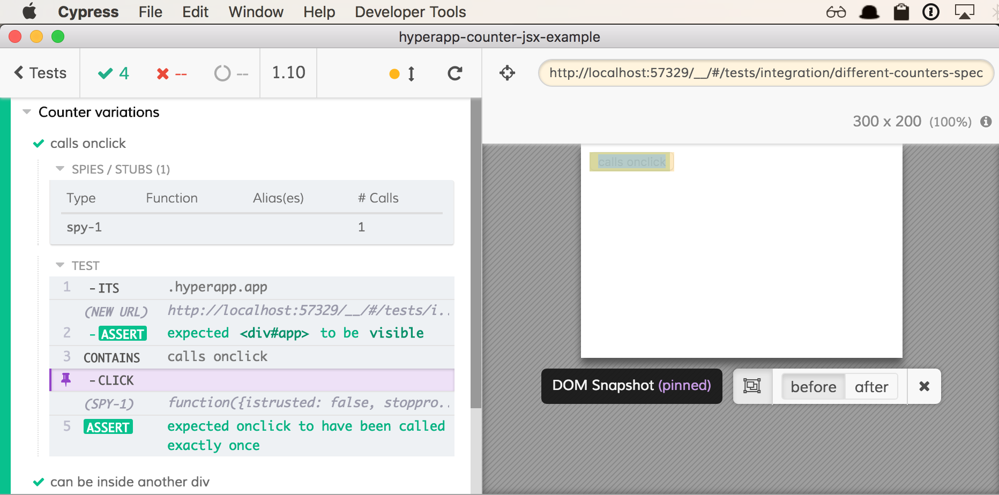

# hyperapp-counter-jsx-example

> Small counter example in Hyperapp and JSX (and Cypress tests)

You can mount your Hyperapp components in the tests using JSX syntax by transpiling it
in the [cypress/plugins/index.js](cypress/plugins/index.js) file.

```js
import { mount } from 'cypress-hyperapp-unit-test'
import { Counter } from '../../src/components/counter'
it('calls onclick', () => {
  const label = 'calls onclick'
  const onclick = cy.spy()
  // our component to test
  const component = <Counter label={label} onclick={onclick} />
  mount({}, {}, () => component)
  cy
    .contains(label)
    .click()
    .then(() => {
      expect(onclick).to.have.been.calledOnce
    })
})
```

When running the test in Cypress you have full browser and can interact / inspect every test step by step.



## More info

- webpack config taken from https://github.com/selfup/hyperapp-one
- Hyperapp - Cypress bridge uses [cypress-hyperapp-unit-test](https://github.com/bahmutov/cypress-hyperapp-unit-test)
